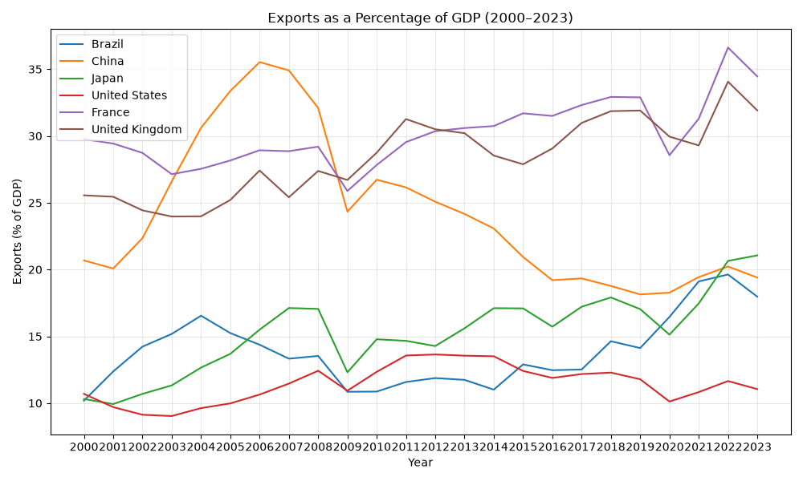
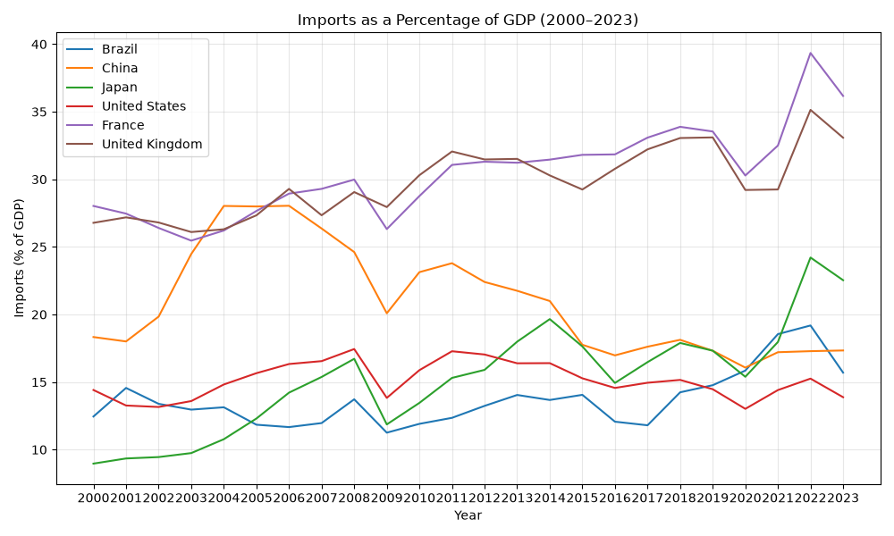
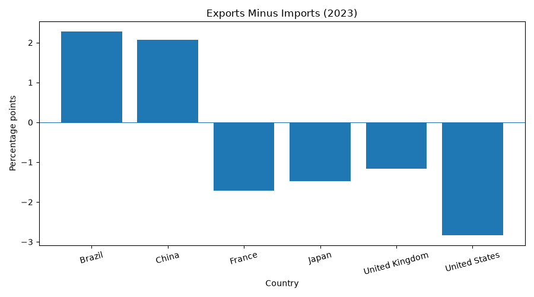

# International Trade Data Explorer

## Overview

This project explores international trade indicators for Brazil, China, Japan, the United States, France, and the United Kingdom.

The analysis compares exports and imports of goods and services as a percentage of GDP over time. It also examines the difference between exports and imports.

The objective of this project is to practice data collection, cleaning, analysis, and visualization with the programming language Python.

## Research Questions

- How have exports changed over time in the countries selected?
- How have imports changed over time in the countries selected?
- How can exports and imports be compared across these countries?
- Which countries have a positive or negative result in the difference between exports and imports?

## Data Source

The data comes from the [World Bank Open Data](https://data.worldbank.org/).

The indicators used are:

- **Exports of goods and services (% of GDP)**
- **Imports of goods and services (% of GDP)**

The dataset includes the following countries:

- Brazil
- China
- Japan
- United States
- France
- United Kingdom

## Built With

- Python
- pandas
- Matplotlib
- CSV data

## Visualizations

### Exports Over Time



### Imports Over Time



### Trade Difference in the Latest Available Year



## How to Run the Project

-Install Python 3.
-Install the libraries:

```bash
pip install pandas matplotlib
```

-Download the repository.
-Run the Python script:

```bash
python3 trade_analysis.py
```

## What I Learned

- How to work with publicly available datasets
- How to work with CSV files
- How to clean and organize data using pandas
- How to create charts with Matplotlib

## Useful Resource

[World Bank Open Data](https://data.worldbank.org/) - Used as data for the analysis and comparison of exports and imports of the countries.

## Author

GitHub: SayuriFerrazoni

## Acknowledgements

Data source: [World Bank Open Data](https://data.worldbank.org/).
